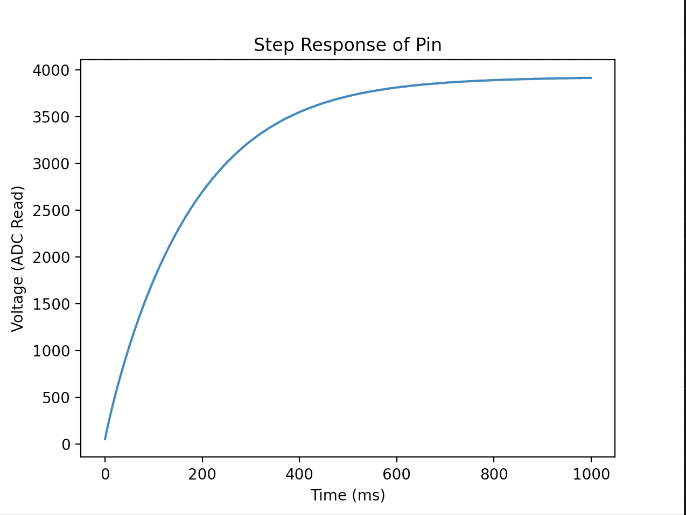
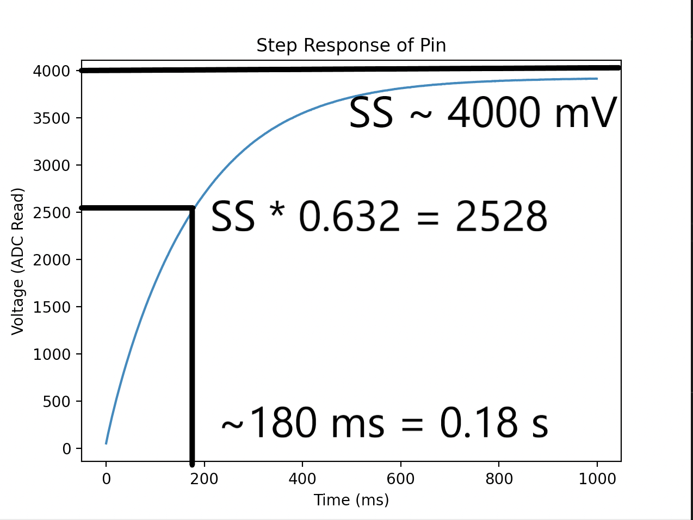

# Lab4
## ME 405 Lab 4 Repository

In this experienment we built an RC circuit on a breadboard, and subsequently subject the electrical system to a step input 
in the form of changing the input pin's signal from "high" to "low". After observing the experimental signal on an oscilloscope, we
used ADC to record the voltage output and then sent the data to our PC via serial communication for plotting in our IDE
of choice. We subsequently determined the RC circuit's experimental and theoretical time constants and compared them. Figure 1 displays
a plot of our experimental voltage versus time data. The first order response to the step input is apparent by inspection.

 
Figure 1. RC circuit response to step input; *R* = 51 k&Omega;, *C* = 3.3 &mu;F.

With a resistance value of 51 k&Omega; and a capacitance of 3.3 &mu;F, the theoretical time constant is ~0.17 seconds. By crude 
inspection of Figure 1, we see that it takes ~180-190 ms to reach 63.2% of the steady state value. Figure 2 displays an annotated
plot of RC voltage versus time. 

 
Figure 1. RC circuit response to step input; *R* = 51 k&Omega;, *C* = 3.3 &mu;F.

